# System Walkthrough
*Generated 2026-04-22T15:11:31*

End-to-end capture of the user journey from landing page through portfolio allocation, produced by `scripts/e2e_system_walkthrough.py`. All 11 screenshots are deterministic given a running backend on :8000 and frontend on :3000 — the chat flow is route-stubbed to avoid depending on an OpenAI key. The scripted profile (composite C = 1.4, A = 7.175, Moderately Conservative) matches the canonical example used in the A-mapping card's consistency test.

## Step 1: Landing page — hero, platform architecture, fund universe entry point
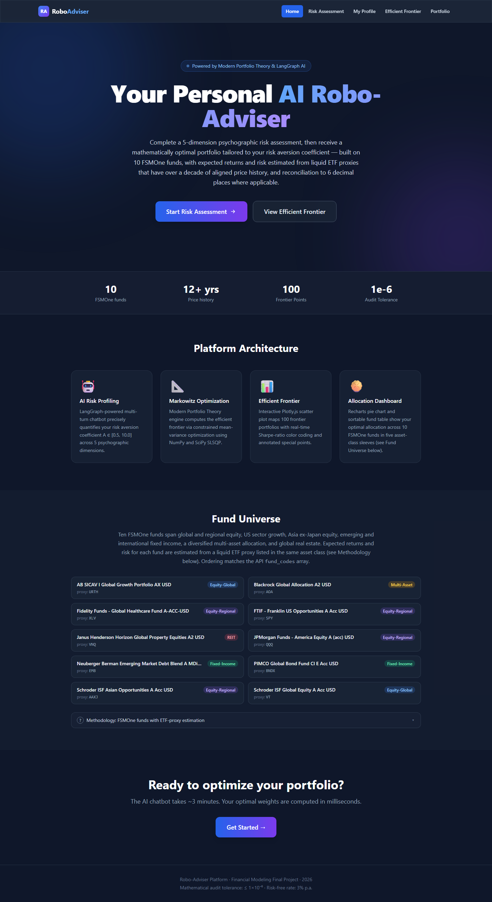

The landing page opens with a gradient hero, four platform-architecture cards explaining the LangGraph risk profiler, Markowitz optimiser, efficient-frontier visualisation, and allocation dashboard, followed by the Fund Universe section and the primary CTA into the risk assessment flow.

## Step 2: Fund Universe — 10 FSMOne funds with ETF proxies and asset-class badges
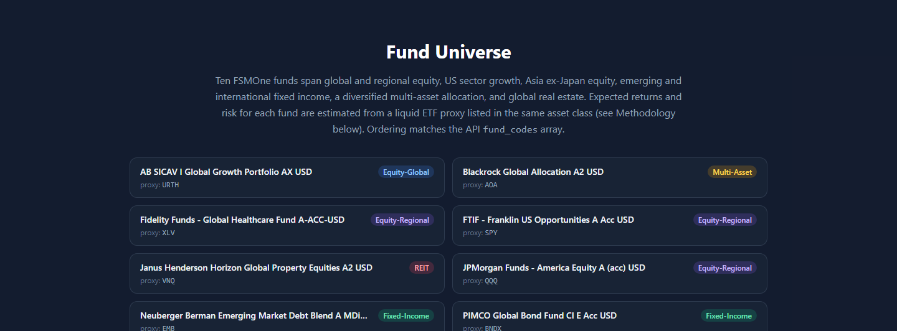

The ten FSMOne funds that form the investable universe, each shown with its full display name, the ETF proxy used for μ/σ estimation, and an asset-class badge. The methodology note at the bottom explains the two-layer architecture (FSMOne display, ETF estimation) documented in §3.7 of the academic report.

## Step 3: Risk assessment — first dimension (investment horizon), 0% progress
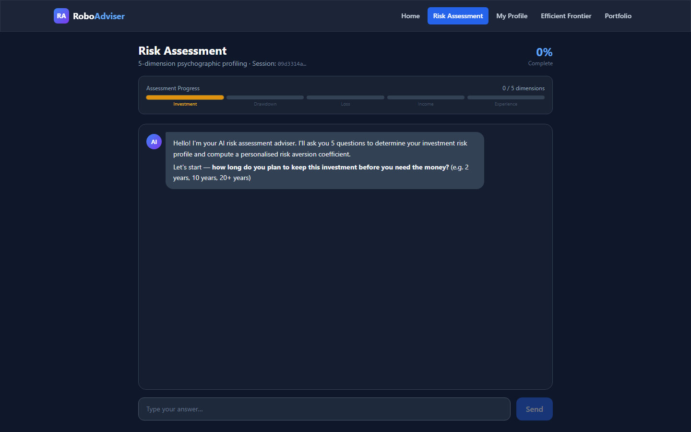

The LangGraph chatbot opens with a fixed welcome and asks the first psychographic question (investment horizon). The progress bar is empty; no API call has been made yet until the user sends the first reply.

## Step 4: Risk assessment — mid flow, 40% progress (2 of 5 dimensions complete)
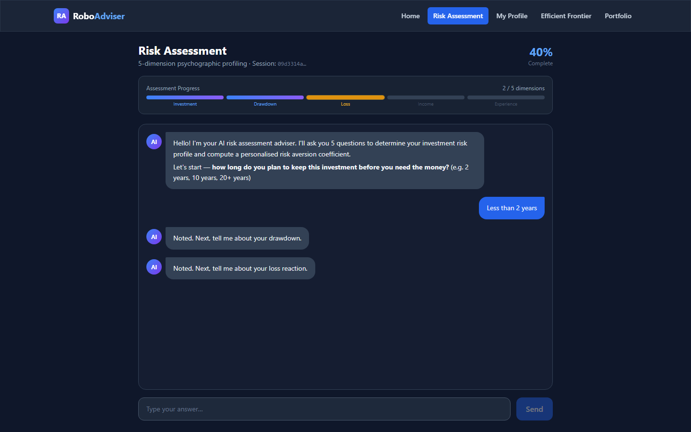

After two user messages, two of the five rubric dimensions are scored. The progress bar fills to 40%. The /api/v1/chat/assess endpoint returns updated state after each turn, and the frontend marks each completed dimension on the progress rail.

## Step 5: Risk assessment — terminal state with profile label and CTA
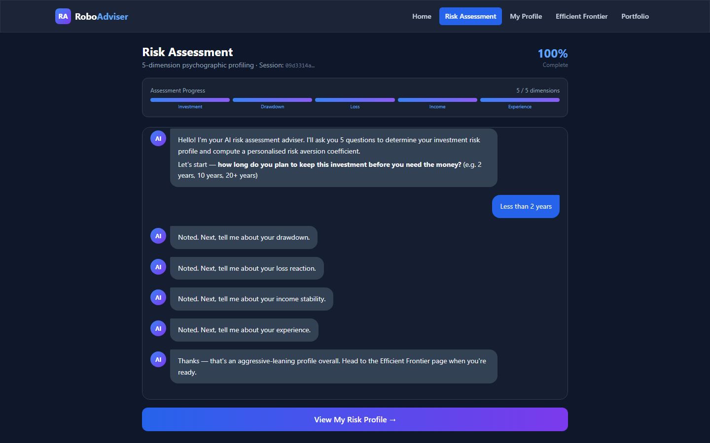

After the fifth dimension is scored, the chatbot enters its terminal state. The response payload includes a complete risk_profile with the risk-aversion coefficient A, the textual profile label, and the five dimension scores. The conversation input is replaced by the CTA to view the risk profile.

## Step 6: Risk profile — hero card, utility function parameters, dimension scores
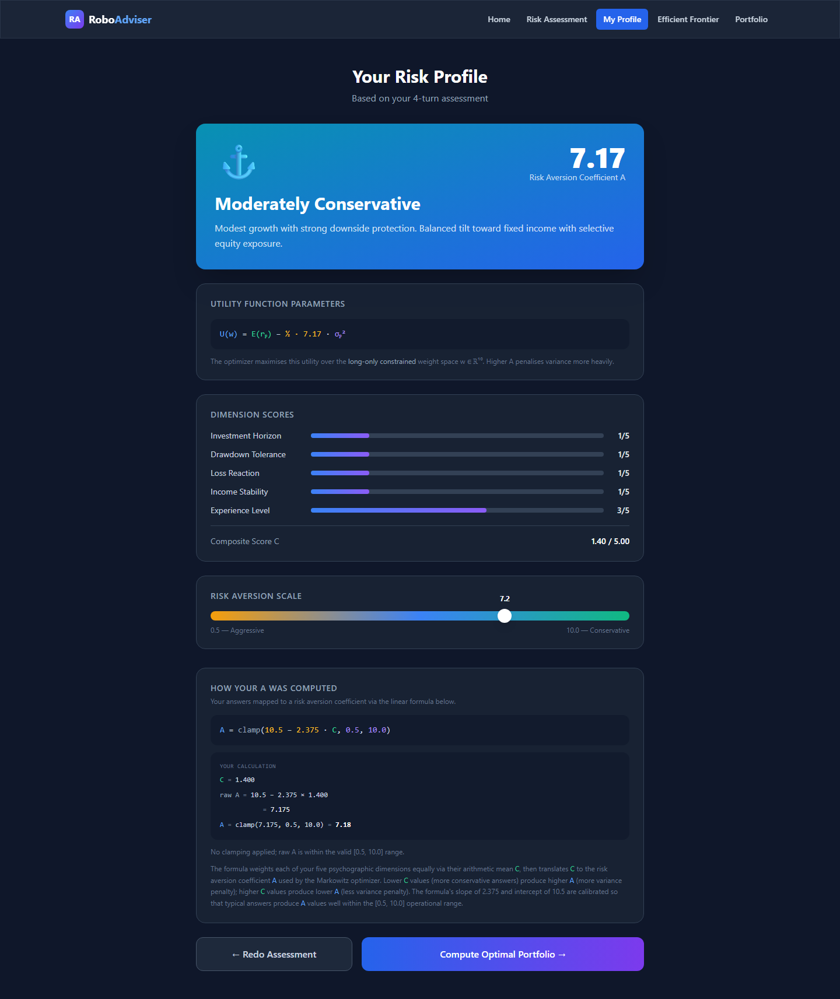

The /profile page summarises the assessment: the hero card shows the profile label and final A (7.17 for this scripted Moderately Conservative run), the Utility Function Parameters card renders U(w) = E(rₚ) − ½·A·σₚ² with A substituted, and the dimension scores card visualises each 1–5 rubric score as a gradient bar with the composite C displayed at the bottom.

## Step 7: A-mapping card — formula with user's values plugged in
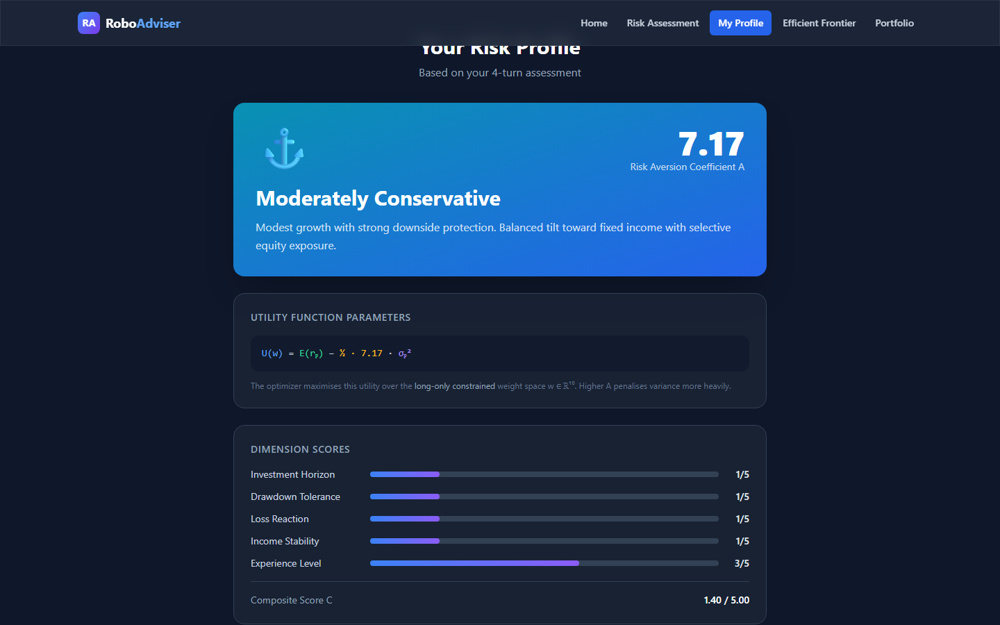

The A-mapping card shows the canonical linear formula A = clamp(10.5 − 2.375·C, 0.5, 10.0) followed by the user's own worked calculation (C = 1.400 → raw A = 7.175 → clamped A = 7.17), a clamp indicator (grey when clamping is not active, amber when it fires), and a plain-language paragraph explaining the slope/intercept calibration.

## Step 8: Efficient frontier — dual frontier, CML, fund dots, special points
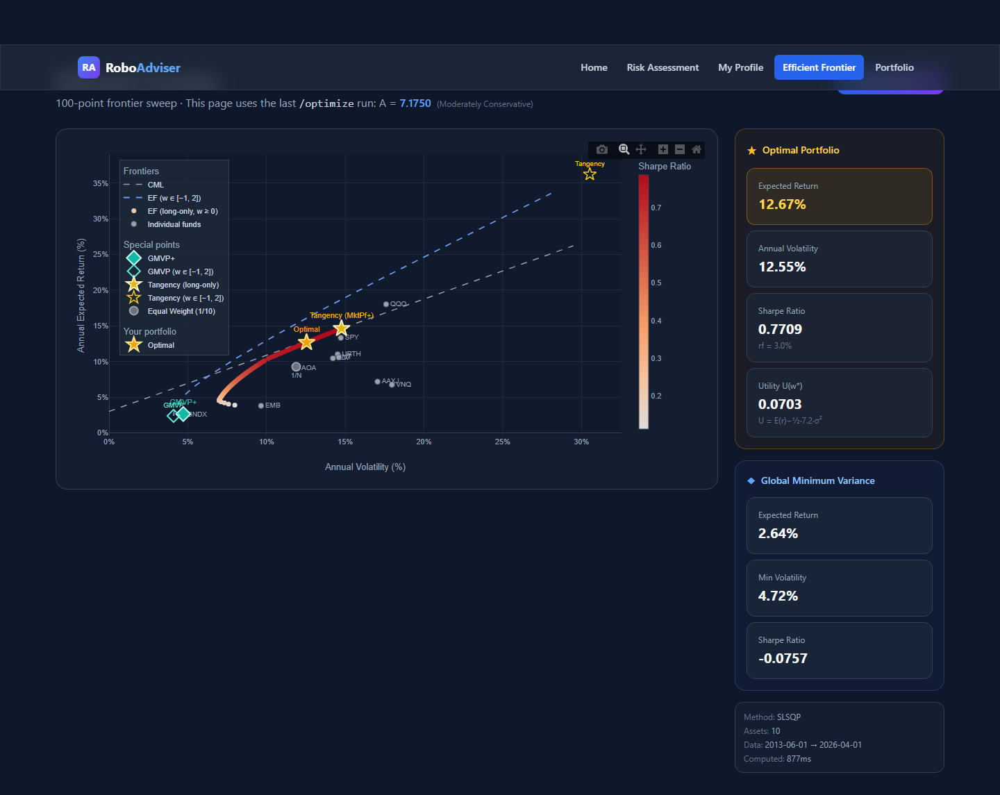

The /frontier page renders both the long-only (Sharpe-coloured) and short-allowed w ∈ [−1, 2] (dashed) efficient frontiers on a shared σ–E(rₚ) plane, with the capital market line anchored on the proper long-only tangency, ten individual fund scatter points labelled by proxy ticker, both GMVPs (filled + hollow teal diamonds), both tangencies (filled + hollow gold stars), the 1/N equal-weight benchmark, and the user's Optimal portfolio.

## Step 9: Efficient frontier — hover tooltip on Tangency (long-only)
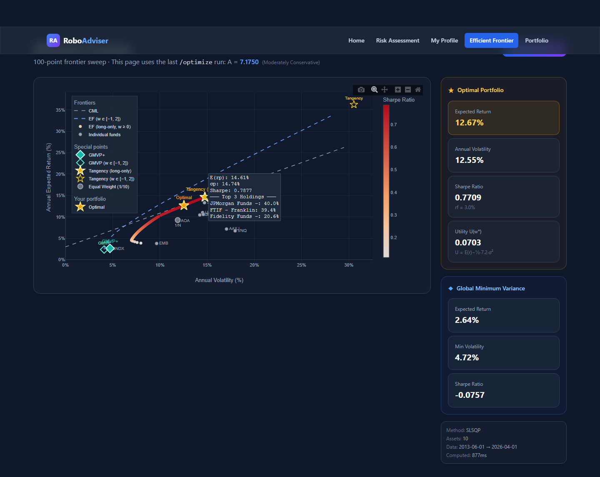

Hovering the long-only tangency marker surfaces Plotly's tooltip with the regime label, expected return, volatility, Sharpe ratio, solver_path provenance (primary vs fallback from Step 2's two-path SLSQP), and the top-three holdings in the tangency portfolio.

## Step 10: Portfolio allocation — pie chart, fund breakdown, summary stats
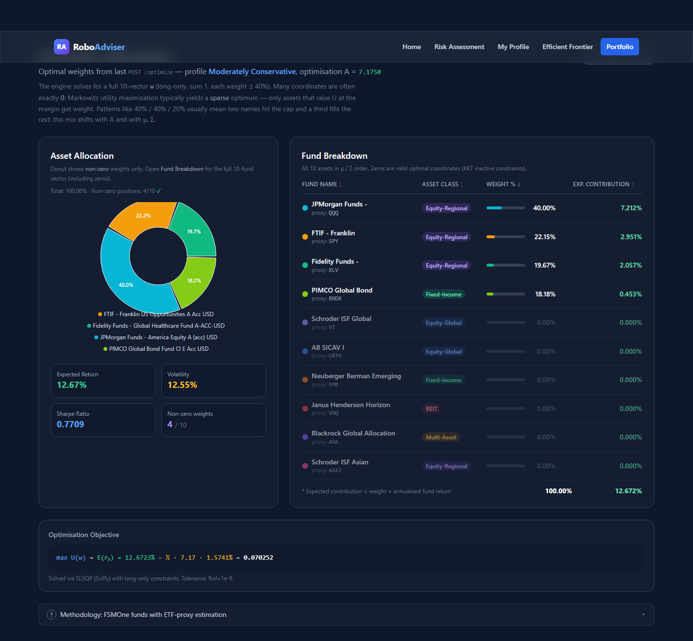

The /portfolio page shows the optimal allocation as a Recharts donut (non-zero positions only) alongside the full 10-fund table including zero-weight funds. Summary cards report the portfolio's expected return, volatility, Sharpe ratio, and count of non-zero positions. Each fund row shows its FSMOne name and the ETF proxy used for estimation.

## Step 11: Portfolio — viewport detail on pie chart and fund breakdown
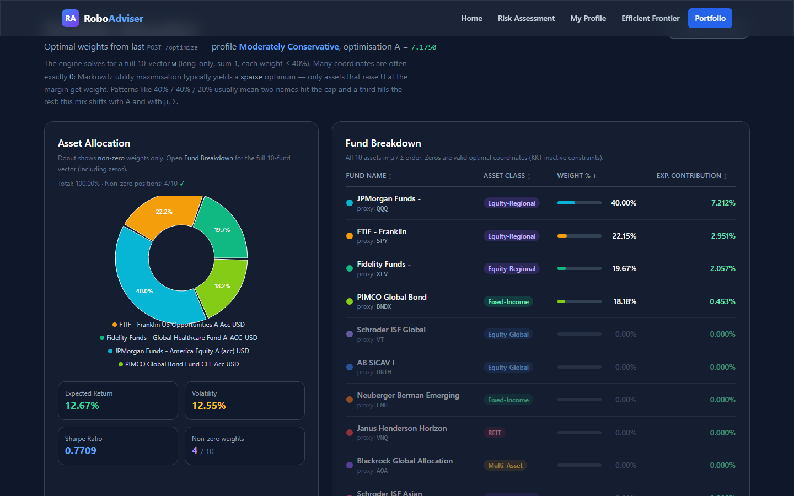

Viewport-scale view of the portfolio upper section with the pie chart non-zero slices directly adjacent to the Fund Breakdown table. Each row shows the FSMOne fund name, ETF proxy ticker, asset-class badge, weight with progress bar, and expected contribution to the portfolio's annualised return (weight × annualised fund return). At the default A = 7.175 with max_single_weight = 0.4, four positions are non-zero: JPMorgan (40% cap), Franklin (22.15%), Fidelity (19.67%), and PIMCO bond (18.18%). The remaining six fund rows are dimmed and show 0.00% — valid KKT inactive-constraint coordinates of the long-only utility-max.
